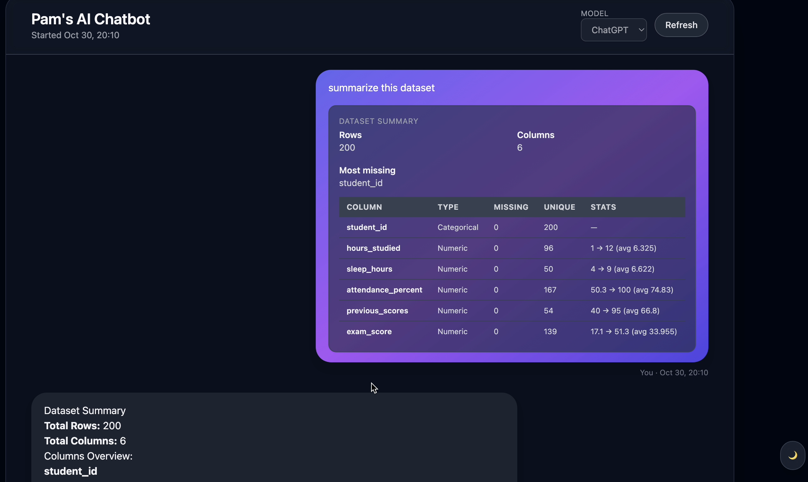
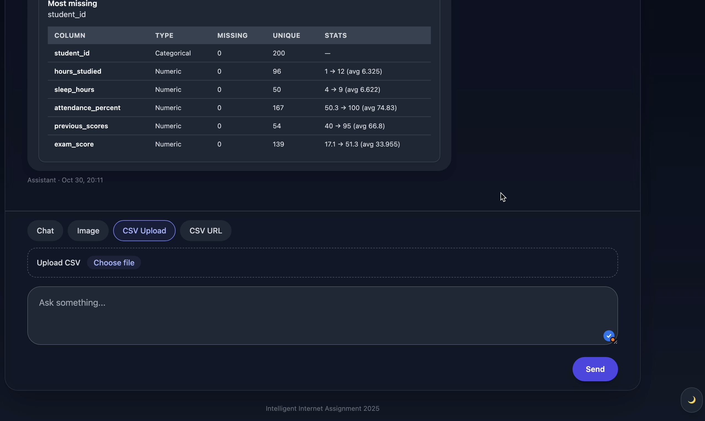

# 🤖 Lightweight Multi-Modal AI Chatbot

This project implements a lightweight, multi-modal chat application designed to handle standard multi-turn conversations, image analysis, and structured data querying from CSV files. The application is built using a modern Node.js/TypeScript stack, reflecting the existing repository structure.

## ✨ Features

The application is built around three core functional areas as required:

### 1. Core Chat Functionality
*   **Multi-Turn History:** Persists and displays the complete conversation history (user and assistant).
*   **Clear Display:** Messages are rendered using basic Markdown, clearly indicating the speaker and timestamp.
*   **Graceful States:** Implements smooth loading and streaming states for a responsive user experience.

### 2. Image Chat (Vision)
*   **Image Upload:** Supports uploading PNG and JPG image files.
*   **In-Chat Preview:** Displays a preview of the uploaded image directly in the chat interface.
*   **Visual Question Answering (VQA):** Allows users to ask questions about the image content, with the assistant's response explicitly referencing the visual context.

### 3. CSV Data Chat (Data Analysis)
*   **Flexible Data Ingestion:** Accepts CSV data via file upload or a pasted raw GitHub URL.
*   **Intelligent Data Querying:** Supports advanced questions about the dataset, including:
    *   Dataset summarization.
    *   Basic statistical analysis for numeric columns.
    *   Identification of columns with the most missing values.
    *   Simple data visualization (e.g., text-based charts or simple plots).
*   **Inline Results:** Displays analysis results, tables, and charts directly in the chat.

## 🛠️ Technology Stack

The project leverages a full JavaScript/TypeScript stack, consistent with the repository's language distribution (JavaScript 52.9%, TypeScript 46.3%).

| Component | Technology | Rationale |
| :--- | :--- | :--- |
| **Frontend (Client)** | React, TypeScript, Tailwind CSS | Modern, component-based UI for a clean and responsive desktop experience. |
| **Backend (Server)** | Node.js (Express/NestJS), TypeScript | High-performance, asynchronous server for handling API calls, file uploads, and processing. |
| **Protocol** | `proto` folder suggests **gRPC** or a similar structured communication protocol. | Ensures efficient, strongly-typed communication between the client and server. |
| **Data Analysis** | `danfo.js` or custom logic with `csv-parser` | A pure JavaScript/TypeScript solution for efficient CSV parsing, statistical analysis, and data manipulation, fulfilling the data chat requirements. |
| **AI/LLM** | OpenAI-compatible API (e.g., GPT-4o, Gemini) | Provides state-of-the-art multi-modal capabilities (text, vision) and function-calling for data analysis. |

## 📂 Clear Project Structure

The project follows a monorepo-like structure, separating the client and server components, as indicated by the repository's root folders.

```
ai-chatbot/
├── client/                 # Frontend application (React/TypeScript)
│   ├── src/
│   │   ├── components/     # UI components (ChatWindow, ImagePreview, CsvUploader)
│   │   └── pages/          # Main application pages
│   ├── package.json
│   └── tsconfig.json
├── server/                 # Backend API (Node.js/TypeScript)
│   ├── src/
│   │   ├── controllers/    # API endpoints and request handling
│   │   ├── services/       # Core business logic (ChatService, DataService)
│   │   └── utils/          # Helper functions (LLM client, CSV processing)
│   ├── package.json
│   └── tsconfig.json
├── proto/                  # Protocol buffer definitions (e.g., for gRPC)
├── student_exam_scores.csv # Example CSV file for testing data chat functionality
├── .env.example            # Template for environment variables
├── .gitignore
└── README.md               # This file
```

## 🚀 How to Run Locally

This guide assumes you have **Node.js** (v18+) and **npm** installed on your system.

### 1. Setup Environment Variables

Create a file named `.env` in the root `ai-chatbot/` directory, copying the contents of `.env.example`. This file is essential for storing your API key securely.

```bash
# .env file content
# Replace YOUR_API_KEY with your actual OpenAI or compatible API key.
OPENAI_API_KEY="YOUR_API_KEY"
```

### 2. Backend Setup (`server/`)

Navigate to the `server/` directory and install the dependencies.

```bash
cd server
npm install
```

Start the Node.js server:

```bash
npm run dev 
# (Assuming redis + mongo is already set up)
# The backend will typically run at http://localhost:3000
```

### 3. Frontend Setup (`client/`)

Open a new terminal, navigate to the `client/` directory, and install the dependencies.

```bash
cd client
npm install
```

Start the React development server:

```bash
npm run dev
# The application will open in your browser at http://localhost:3001
```

The frontend is configured to communicate with the backend API.

### 4. Potential Optimization Features (`server/src/futureOptimzation`)

I haven't got time to finish some features for the optimization process. Some of them are located in the directory above

## 📹 Short Video Demo

**(Placeholder: A short video demo showcasing the three core features—multi-turn chat, image analysis, and CSV data querying—will be linked here.)**

*   **Demo Link:** `[Link to Demo Video]`

## 📝 Non-Functional Expectations

*   **Code Quality:** Focus on clear, idiomatic TypeScript with strong typing, modular design, and adherence to modern Node.js/React best practices.
*   **Error Handling:** Robust error handling in both client and server to gracefully manage API failures, file parsing errors (e.g., malformed CSV, unsupported image type), and large file limits. User-friendly error messages are returned to the frontend.
*   **UI/UX:** A clean, minimal interface using Tailwind CSS, prioritizing desktop usability.
*   **Security:** All sensitive credentials are managed via the `.env` file and are not committed to the repository.
